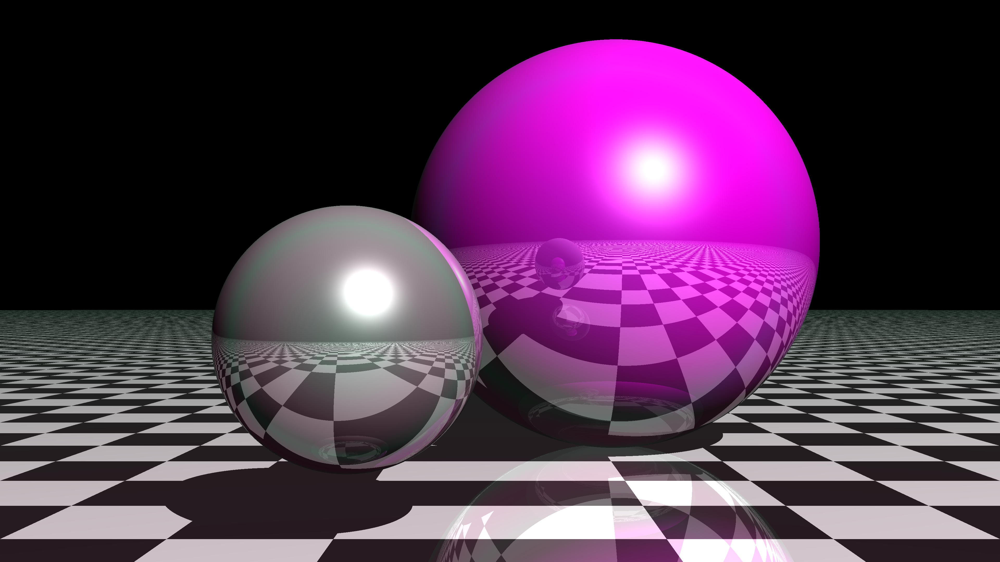

# Python Ray Tracer

## About

After several years of using rendering engines such as Pixar's RenderMan, Arnold or Mantra, I was tempted by the idea of exploring ray tracing in greater depth while deepening my knowledge of Python.
Yes, python. A language by nature rather slow, and therefore far from being the preferred language for this exercise.

Challenge accepted, project launched !

## Results



1. Diffuse
2. Diffuse + Specular + shadows
3. Specular roughness variations
4. Iridescence
5. Domelight
6. Reflections
7. Textures (checker,...)

### Time performances

## Contributing

### Install

```sh
pip install numpy pillow
```

### Usage

You can run this example:

```py
import time
from pathlib import Path

from ray_tracer.application import render_image_pipeline
from ray_tracer.domain import Camera, DomeLight, PointLight, Scene3D
from ray_tracer.infrastructure import (
    CheckeredSphere,
    NumpyRenderer,
    NumpyRGBColor,
    NumpySphere,
    Vector3D,
)

renderer = NumpyRenderer()

scene = Scene3D(
    [
        NumpySphere(
            Vector3D(0.55, 0.5, 3),
            0.5,
            NumpyPhysicalShader(
                Diffuse(Vector3D(1, 1, 1), 1.0),
                Specular(Vector3D(0, 1, 1), 0.5, 0.5),
                0.0,
                0,
                0.01,
                0,
            ),
        ),
        NumpySphere(
            Vector3D(-0.55, 0.1, 1),
            1,
            NumpyPhysicalShader(
                Diffuse(Path("sourceimages/2k_mars.jpg"), 1.0),
                Specular(Vector3D(1, 1, 1), 1.0, 0.5),
                0,
                0.1,
                0.1,
                0.0,
            ),
        ),
        NumpySphere(
            Vector3D(0, -99999.5, 0),
            99999,
            NumpyPhysicalShader(
                Diffuse(Vector3D(1, 1, 1), 1.0),
                Specular(Vector3D(0, 1, 1), 0.5, 0.5),
                0.1,
                0.5,
                0.0,
                1.0,
            ),
        ),
    ],
    [  # TODO: use multiple lights
        PointLight(1.0, Vector3D(-5, 5, -10)),
        # PointLight(Vector3D(-2, 1, 2)),
        DomeLight(0.1, Vector3D(1, 1, 1)),
    ],
    Camera(Vector3D(0, 0.2, -2), int(1920 / 2), int(1080 / 2)),
)

output_path = Path("render.png")

start_time = time.time()
render_image_pipeline(scene, output_path, renderer)
print("Took", time.time() - start_time)
```
